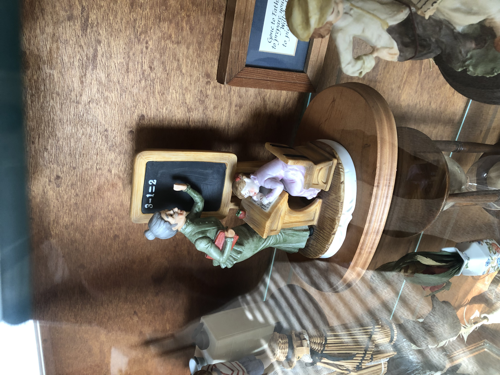

JPEG Algorithm in Python

## Files

There are 4 `.py` files in the folder

* `010.dct.py` is the code for discrete cosine transform
* `020.quant.py` is the code for quantizers
* `100.mutidim-idct.py` puts everything together

You can also use the images to reproduce the results in the video.

and

